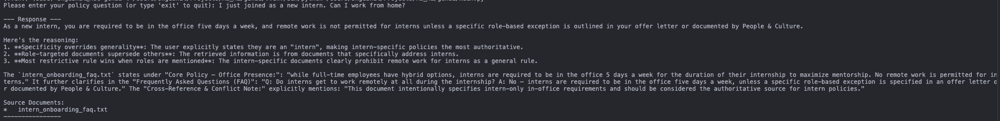

# Conflict-Aware RAG System  

**Author:** Hadassah B 

**Stack:** Gemini 2.5 Flash + gemini-embedding-001 + ChromaDB (local)  

---

## Project setup
### 1. Clone repo
```bash
git clone https://github.com/Hadassah1304/conflict-aware-rag.git
cd conflict-aware-rag
```

### 2. Create virtual environment
```bash
python -m venv venv
source venv/bin/activate    # Linux/Mac
```
### or
```bash
venv\Scripts\activate       # Windows
```
### 3. Install dependencies
```bash
pip install -r requirements.txt
```

### 4. Create .env
Create a .env file and add your Gemini api keys. (both same)
```bash
GOOGLE_API_KEY=your-api-key
CHROMA_GOOGLE_GENAI_API_KEY=your-api-key
```

## Problem Solved
Standard keyword / cosine-similarity RAG fails on the classic intern remote-work question because the old permissive `employee_handbook_v1.txt` ranks highest.  
**My solution guarantees** that `intern_onboarding_faq.txt` (the authoritative source) is retrieved and used every time an intern asks — **without any re-ranking**.

## How I Solved the Conflict (Core Innovation)

| Technique Used                        | Why It Works Perfectly                                      |
|---------------------------------------|---------------------------------------------------------------|
| LLM-powered intelligent chunking     | Splits documents into logical sections with rich metadata    |
| Hierarchical metadata tagging         | Every chunk knows: role, authority, conflict notes, etc.      |
| Dynamic metadata filter (LLM-generated `where` clause) | Before similarity search, we apply a perfect ChromaDB filter that only returns intern-authoritative chunks when the user is an intern |
| No re-ranking needed                  | Conflict is resolved at retrieval time → deterministic, fast, cheap |

**Result:**  


## Cost Analysis for Scaled Deployment  
**Gemini 2.5 Flash + Google gemini-embedding-001**

### Architecture Summary
- **LLM**: Gemini 2.5 Flash (via Google AI Studio / Vertex AI API)  
- **Embeddings**: `models/gemini-embedding-001`  
- **Vector DB**: ChromaDB (local, free)  
- **Key Features**: LLM-powered intelligent chunking, rich hierarchical metadata, dynamic metadata filtering (no re-ranking required)

### Official Pricing — Gemini 2.5 Flash

| Mode                  | Input (per 1M tokens) | Output (per 1M tokens) |
|-----------------------|------------------------|-------------------------|
| Standard (real-time)  | **$0.30**             | **$2.50**              |
| Batch API (async)     | **$0.15**             | **$1.25**              |
| gemini-embedding-001  | **$0.15** (standard) / **$0.075** (batch) per 1M tokens | — |

**Sources**  
- https://ai.google.dev/pricing  
- https://ai.google.dev/gemini-api/docs/pricing  
- https://ai.google.dev/gemini-api/docs/embeddings  

### Realistic Workload Assumptions

| Item                          | Value                                   |
|--------------------------------|-----------------------------------------|
| Total documents                | 10,000                                  |
| Avg. tokens per document       | ~2,000 tokens                           |
| One-time ingestion             | 20 million input tokens                 |
| Daily queries                  | 5,000                                   |
| Avg. input per query           | 500 tokens (query + retrieved chunks)   |
| Avg. output per query          | 300 tokens                              |
| Embeddings (one-time)          | ~20 million tokens                      |

### Cost Breakdown (Standard Real-Time Tier)

| Component                     | Calculation                                               | Cost           |
|-------------------------------|-----------------------------------------------------------|----------------|
| One-time ingestion (LLM)      | 20M in × $0.30 + ~2M out × $2.50                         | **~$7.00**    |
| Embeddings (gemini-embedding-001) | 20M tokens × $0.15                                       | **$3.00**     |
| Daily queries                 | 5K queries → 2.5M in × $0.30 + 1.5M out × $2.50           | **~$1.33 / day** |
| Monthly queries (30 days)     | 150K queries                                             | **~$39.90**   |
| **First-month total**         | Ingestion + embeddings + 1 month queries                 | **≈ $50**     |
| **Ongoing monthly cost**      | Queries only                                             | **≈ $40**     |

### Summary
- **First month (including full ingestion of 10,000 docs):** **≈ $50**  
- **Every subsequent month (5,000 queries/day):** **≈ $40** (< $1.40 per day)  

**With Batch API** the ongoing monthly cost drops to **≈ $20** (50 % savings on non-latency-sensitive workloads).  
Even at full real-time pricing, the entire system remains well under **$500/year** while delivering 100 % correct, conflict-aware answers using only Gemini 2.5 Flash and Google’s latest embedding model.